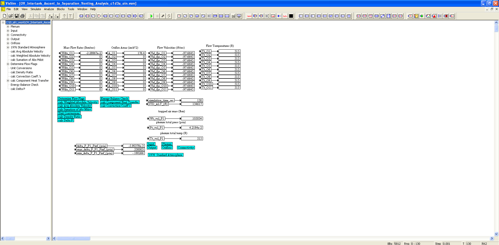
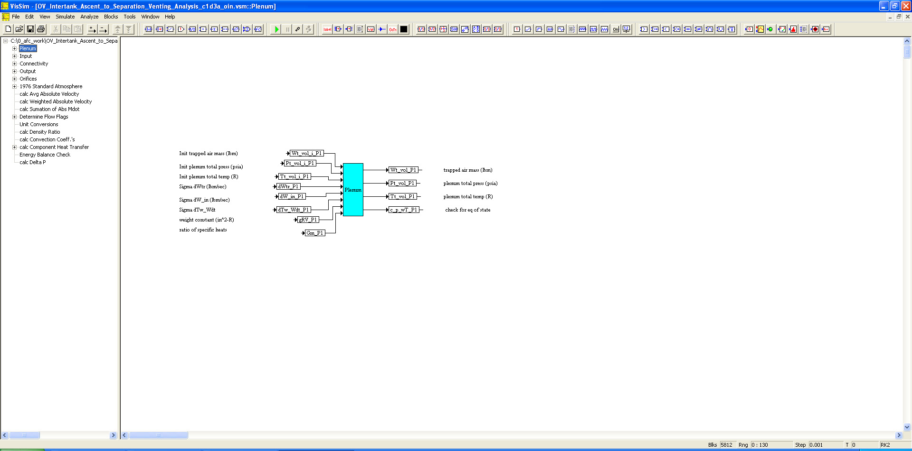
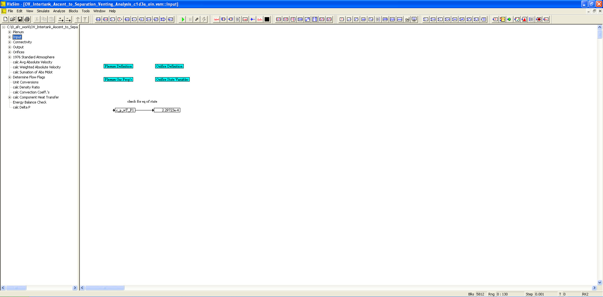
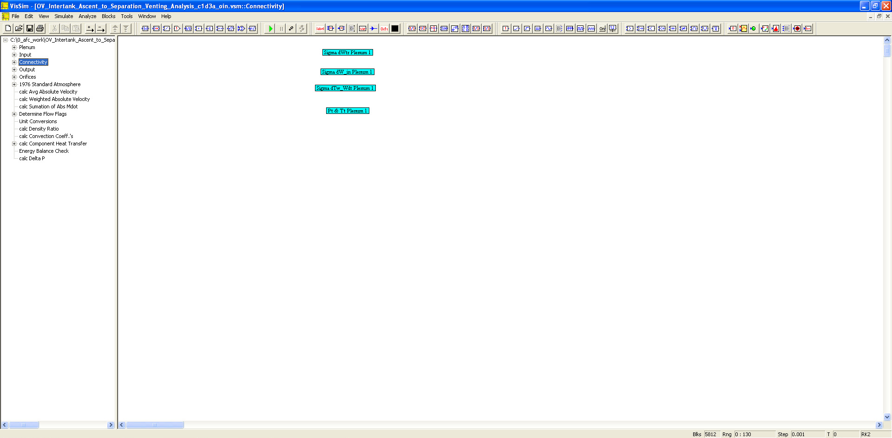
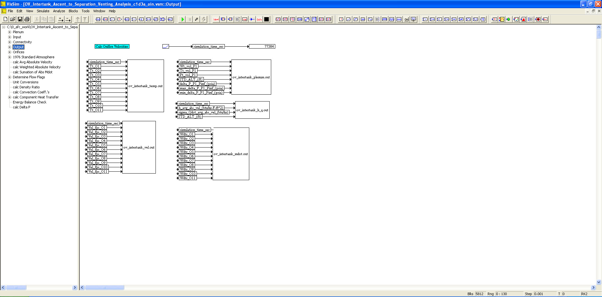
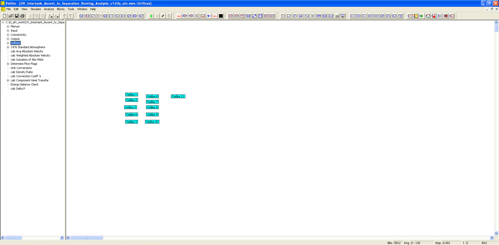
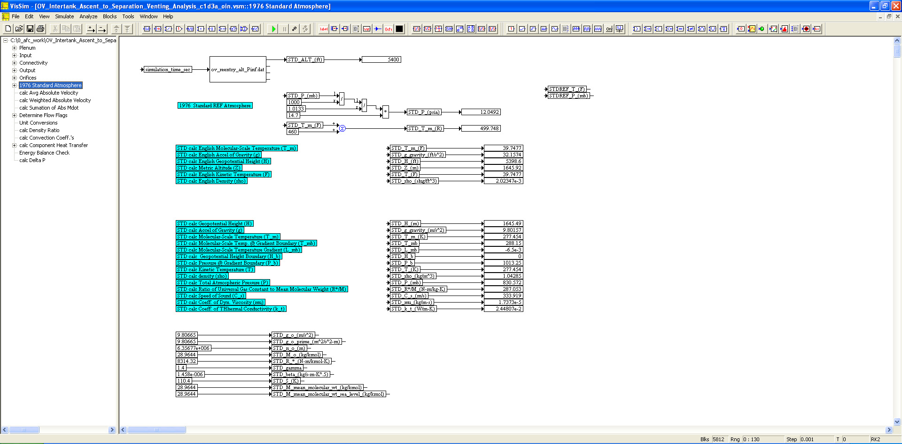

# ========================================
# Orbital Vehicle Intertank Reentry Venting Analysis using VISSIM:
# ========================================

## Orbital Vehicle Intertank Reentry Venting Analysis using VISSIM.

##
## I. Operation: "./VISSIM/OV_Intertank_Reentry_Venting_Analysis_c1d3b_oin.vsm"

##
## II. OV Intertank Reentry Venting Analysis Top Level Diagram:

##
## III. Plenum Sub-System Level Diagram:

##
## IV. Input Sub-System Level Diagram:

##
## V. Connectivity Sub-System Level Diagram:

##
## VI. Output Sub-System Level Diagram:

##
## VII. Orifices Sub-System Level Diagram:

##
## VIII. 1976 Standard Atmosphere Sub-System Level Diagram:

##
#### XXVa. Results: "./VISSIM/ov_intertank_h_q.out"
#### XXVb. Results: "./VISSIM/ov_intertank_mdot.out"
#### XXVc. Results: "./VISSIM/ov_intertank_plenum.out"
#### XXVd. Results: "./VISSIM/ov_intertank_temp.out"
#### XXVe. Results: "./VISSIM/ov_intertank_vel.out"

## 
## *Note: 
## 1. Performance Data and Analysis performed using VISSIM, ( https://web.solidthinking.com/vissim-is-now-solidthinking-embed )

